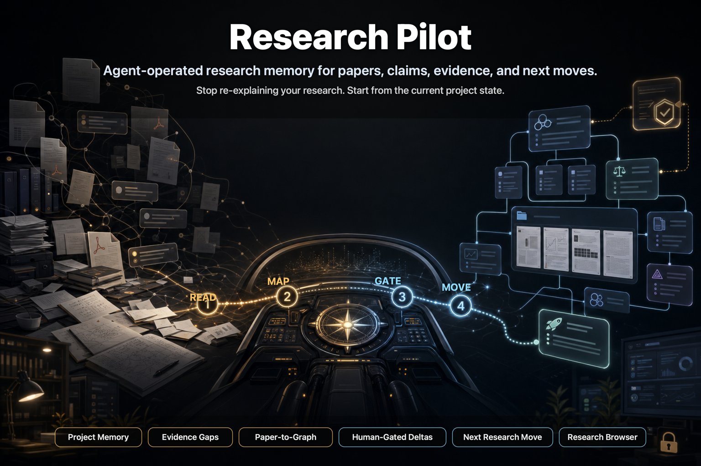

<h1 align="center">Research Pilot</h1>

<p align="center">
  <strong>Turn papers, research chats, experiments, and project notes into a private research memory your AI agent can understand, update, and use to plan the next move.</strong>
  <br />
  <em>Codex-compatible. Zotero-first. Local workspace. Human-gated project understanding.</em>
</p>

<p align="center">
  <a href="#-quick-start"></a>
  <a href="LICENSE"></a>
  <a href="#-quick-start"></a>
  <a href="#-zotero-first-source-boundary"></a>
  <a href="#-research-browser"></a>
  <a href="#-private-by-design"></a>
</p>

<p align="center">
  
</p>

---

**You are starting a research project. Papers pile up. Chats disappear. Claims drift. Evidence gaps are hard to see. Where should your agent begin?**

Research Pilot is an agent-operated research memory plugin. It gives your AI agent a private local workspace where project questions, claims, evidence, warrants, limitations, paper dossiers, experiments, graph deltas, and human decisions compound over time.

This repo is the public plugin source. The installer keeps a local plugin checkout under `~/.research-pilot/repo` and links its skills into your agent environment. Your visible research files live in the private workspace you initialize after installation.

The goal is not another notes app. The goal is a research agent that knows your project well enough to tell what is missing, read new papers in context, propose updates, and stop for human approval before changing project understanding.

> **Research Pilot does not replace Zotero, your judgment, or your research taste. It gives the agent a durable memory structure so every paper and decision can update the project instead of vanishing into chat history.**

---

## ✨ What It Helps You Do

### Keep the agent oriented

Start from project state, not a blank chat. The agent can inspect your current Project Understanding Graph, project query pack, open deltas, paper dossiers, and generated reports before answering.

### Read papers in project context

Deep-read a paper into a project-local dossier, extract paper claims/evidence/limitations, translate them into project impact, and propose graph deltas instead of producing a generic summary.

### Find missing evidence

Ask which claims have weak support, missing warrants, open limitations, or unresolved translation gaps. Turn those gaps into paper-search contracts or experiment proposals.

### Let humans approve memory updates

The agent proposes D* deltas. You accept, reject, park, or request revision. Only accepted deltas enter append-only graph events.

<table>
  <tr>
    <td width="50%" valign="top">
      <h3>🔎 Gap Detection</h3>
      <p>Surface unsupported claims, weak warrants, missing evidence, and experiment needs from the current graph.</p>
    </td>
    <td width="50%" valign="top">
      <h3>📄 Paper Dossiers</h3>
      <p>Convert project-relevant papers into agent-readable questions, claims, evidence, warrants, limitations, and proposed deltas.</p>
    </td>
  </tr>
  <tr>
    <td width="50%" valign="top">
      <h3>✅ Human-Gated Deltas</h3>
      <p>Preview graph changes, dry-run effects, then accept, reject, park, or revise before memory changes.</p>
    </td>
    <td width="50%" valign="top">
      <h3>🧪 Experiment Proposals</h3>
      <p>Suggest experiments from weak claims, missing evidence, and limitations without pretending the results already exist.</p>
    </td>
  </tr>
  <tr>
    <td width="50%" valign="top">
      <h3>🧭 Next Research Move</h3>
      <p>Recommend whether to search, deep-read, update a question, design an experiment, or resolve an open delta.</p>
    </td>
    <td width="50%" valign="top">
      <h3>🖥️ Research Browser</h3>
      <p>Open a local dashboard to inspect projects, papers, graph snapshots, deltas, gaps, and experiment proposals.</p>
    </td>
  </tr>
</table>

---

## 🚀 Quick Start

### 1. Install Research Pilot

```bash
curl -fsSL https://raw.githubusercontent.com/QZhang2111/Research-Pilot/main/install.sh | bash
```

This clones or updates the plugin source in `~/.research-pilot/repo`, links skills into `~/.agents/skills/`, and creates `~/.research-pilot/bin/research-pilot-init`.

### 2. Initialize a private research workspace

```bash
~/.research-pilot/bin/research-pilot-init ~/Research/MyResearchWiki
```

Your research data lives in that workspace, not in this public repo.

### 3. Start the agent inside your workspace

```bash
cd ~/Research/MyResearchWiki
codex
```

Ask:

```text
Use Research Pilot to inspect this workspace and help me start a project.
```

This triggers the first-run flow: the agent checks workspace state, collects minimum project context, creates the first project skeleton, and stops for human approval before changing graph truth.

### 4. Make the first project update through human gate

Ask:

```text
Add my first project question: does this model family encode interaction knowledge?
```

The agent should propose a graph delta, dry-run it, and wait for your decision before updating project memory.

### 5. Open the Research Browser

From anywhere:

```bash
python3 ~/.research-pilot/repo/tools/build_dashboard_index.py --repo ~/Research/MyResearchWiki --output ~/.research-pilot/repo/.dashboard/index.json
python3 ~/.research-pilot/repo/tools/research_browser_server.py --repo ~/Research/MyResearchWiki --port 8765
```

Then visit:

```text
http://127.0.0.1:8765/dashboard/index.html
```

---

## 🧪 What You Can Ask The Agent

```text
Where does this project stand?
```

```text
What claim has the weakest evidence?
```

```text
Read this paper in project context and propose graph deltas.
```

```text
Show open deltas waiting for human review.
```

```text
Find papers for this missing evidence gap.
```

```text
What experiment would most reduce uncertainty?
```

```text
Based on current graph state, what should I do next?
```

---

## 🧩 Core Loop

Research Pilot keeps the project loop explicit:

```text
project question
-> Zotero paper / experiment / human discussion
-> paper dossier or proposal
-> Project Understanding Graph delta
-> human gate
-> append-only graph event
-> graph.db / snapshot / markdown report / dashboard
-> next research move
```

The graph event log is the source of truth for project understanding. Snapshots, SQLite, markdown reports, and dashboard data are rebuildable read models.

---

## 🧱 Mental Model

```text
Research Pilot repo = hidden plugin source and tools
User research workspace = private research memory
Agent chat = primary interface
Zotero = paper metadata, PDFs, collections, tags
Markdown = long-term agent-readable memory
Graph events = append-only project-understanding truth
Generated DB/reports/dashboard = rebuildable read models
```

The hidden plugin checkout is the tool factory. Your private workspace is the research site.

---

## 🔗 Zotero-First Source Boundary

Research Pilot assumes Zotero remains the normal paper manager.

```text
Zotero = paper metadata, PDFs, collections, tags, reading status mirror
wiki = digested research understanding and project files
wiki/graphs/events = append-only project understanding graph truth
graph.db/snapshots/reports = rebuildable read models
dashboard = browser view over read models and wiki state
chat/agent = primary control surface
```

DOI, arXiv, URL, or manual refs can be captured during setup and dry-runs, but they are not a replacement for Zotero as the paper source of truth.

---

## 🖥️ Research Browser

The Research Browser is a local dashboard over generated read models. It helps you inspect project state, papers, graph snapshots, deltas, gaps, and experiment proposals.

It observes:

```text
.dashboard/index.json
wiki/graphs/snapshots/
wiki/graphs/graph.db
wiki/projects/
```

It is not source of truth. Graph truth remains:

```text
wiki/graphs/events/**/*.jsonl
```

---

## 📦 What Is Included

- Codex plugin manifest at `.codex-plugin/plugin.json`.
- Curl-based Codex-compatible installer.
- `research-pilot` router skill.
- Private workspace initializer.
- Workspace templates with no private research data.
- Graph-event validation.
- Graph snapshot generation.
- SQLite graph read-model generation.
- Generated project graph markdown reports.
- Read-only graph query commands.
- Read-only gap detection and next-action routing.
- Project understanding update and evidence synthesis protocols.
- Gap-driven search contracts and user-facing gap discovery.
- Read-only experiment proposal generation.
- Zotero bridge helpers for configurable metadata/status workflows.
- Human-gated delta dry-run, registration, and decision commands.
- Project-local paper dossier creation, validation, and delta export.
- Zotero-first source identity intake with manual source-reference capture for setup/dry-run cases.
- Research Browser dashboard served from plugin UI files over workspace read models.

---

## 🔬 Operator Commands

Run the full release check:

```bash
./scripts/release_check.sh
```

Run the graph-core smoke test:

```bash
./scripts/smoke_mvp_b.sh
```

Build graph read models in a workspace:

```bash
python3 tools/graph_validate.py --repo ~/Research/MyResearchWiki --project DemoProject
python3 tools/build_graph_snapshot.py --repo ~/Research/MyResearchWiki --project DemoProject
python3 tools/build_graph_db.py --repo ~/Research/MyResearchWiki --project DemoProject
python3 tools/build_project_graph_report.py --repo ~/Research/MyResearchWiki --project DemoProject
python3 tools/graph_query_cli.py summary --repo ~/Research/MyResearchWiki --project DemoProject --json
```

Detect gaps and recommend next action:

```bash
python3 tools/project_gap_cli.py detect --repo ~/Research/MyResearchWiki --project DemoProject --json
python3 tools/project_next_action_cli.py suggest --repo ~/Research/MyResearchWiki --project DemoProject --json
```

Generate gap-search leads and experiment proposals:

```bash
python3 tools/gap_search_cli.py contract --repo ~/Research/MyResearchWiki --project DemoProject --target RL0 --json
python3 tools/research_gap_discovery_cli.py run --repo ~/Research/MyResearchWiki --project DemoProject --gap RL0 --source memory --json
python3 tools/project_experiment_cli.py suggest --repo ~/Research/MyResearchWiki --project DemoProject --target C0 --json
```

Preview, register, and accept a graph delta:

```bash
python3 tools/graph_delta_cli.py dry-run --repo ~/Research/MyResearchWiki --project DemoProject --delta examples/demo/deltas/refine-demo-claim.json --json
python3 tools/graph_delta_cli.py register --repo ~/Research/MyResearchWiki --project DemoProject --delta examples/demo/deltas/refine-demo-claim.json --json
python3 tools/graph_delta_cli.py decide --repo ~/Research/MyResearchWiki --project DemoProject --id D1 --decision accept --json
```

Create a project-local paper dossier and export proposed deltas:

```bash
python3 tools/paper_dossier_cli.py create --repo ~/Research/MyResearchWiki --project DemoProject --paper paper-a --title "Paper A"
python3 tools/paper_dossier_cli.py validate --dossier ~/Research/MyResearchWiki/wiki/projects/DemoProject/papers/paper-a/index.md --json
python3 tools/paper_dossier_cli.py export-deltas --dossier ~/Research/MyResearchWiki/wiki/projects/DemoProject/papers/paper-a/index.md --output-dir ~/Research/MyResearchWiki/.research-pilot/generated/deltas --json
```

Project understanding update and evidence synthesis are agent workflows, not direct approval shortcuts:

```text
skills/project-understanding-update
skills/project-evidence-synthesis
wiki/_system/workflows/project-understanding-update.md
wiki/_system/workflows/project-evidence-synthesis.md
```

---

## 📚 Guides

- [Install](docs/guides/install.md)
- [Workspace](docs/guides/workspace.md)
- [Zotero](docs/guides/zotero.md)
- [Dashboard](docs/guides/dashboard.md)
- [Core workflows](docs/guides/core-workflows.md)
- [Source boundaries](docs/guides/source-boundaries.md)

---

## 🔒 Private By Design

Do not put real paper PDFs, Zotero API keys, local Zotero databases, private project dossiers, generated private dashboard data, or personal research memory into this public repo.

Each user should keep their research memory in their own private workspace.

---

## 🤝 Contributing

This project is an early public extraction. Useful contributions should preserve the core boundary:

```text
agent chat = primary interaction
human gate = required for project truth
workspace data = private
public repo = reusable plugin kit
```
